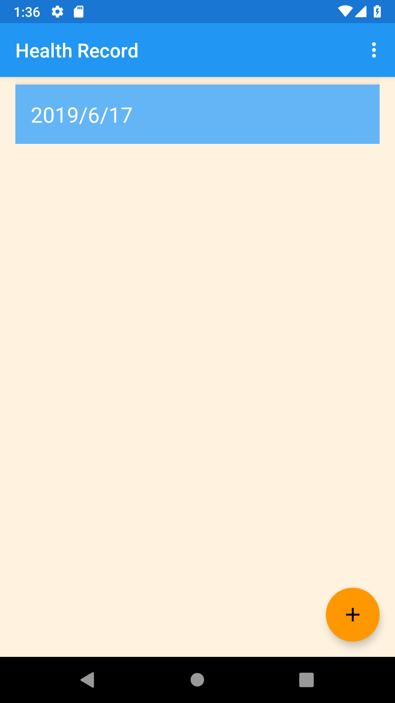
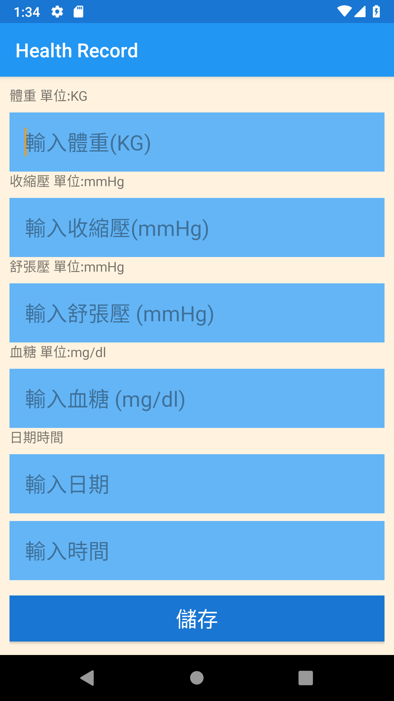
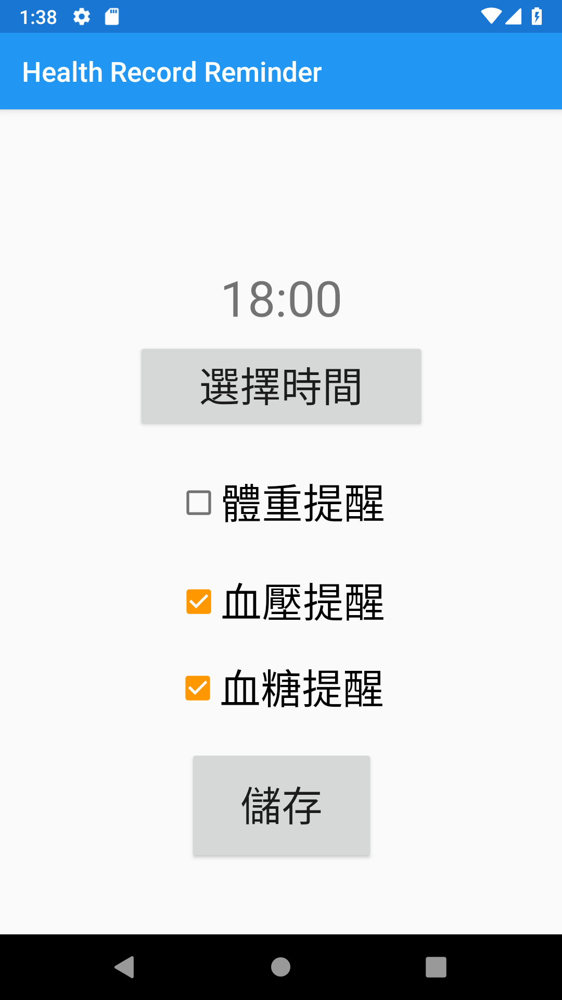
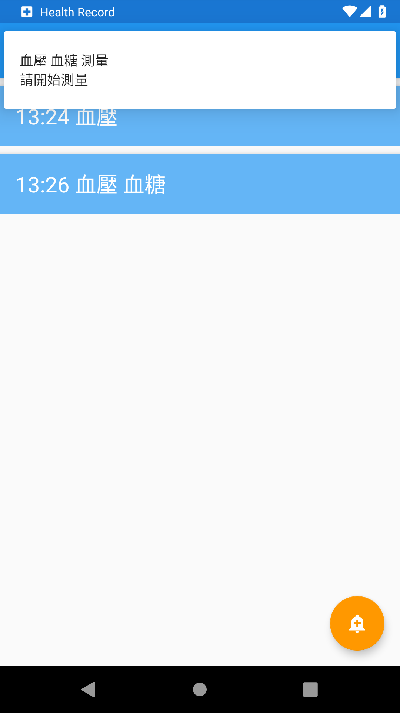
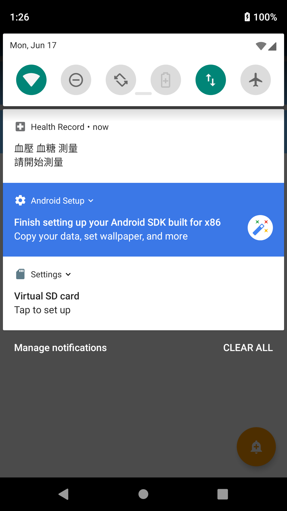

# Health Recorder
An app that records patients' health data, says weight, blood pressure and blood sugar.  
User can set reminder to remind them to record the data regularly everyday.  
The app reminds user with notification only if user have set the reminder.  

## List of tools  
Android Studio  

## Libraries

## Contribution

#### P76071404 陳冠廷  
 - Database of health data   
 - View of Health data record
 - Creating and updating health data record

#### P76075050 黃達軒  
 - Database of reminder   
 - View of reminder  
 - Creating and updating reminder
  
#### P76071284 張家豪  
 - Creating invertal notification  
 - Update notification if time of reminder changes
 
 
 ## Screenshots
 
 #### Record
 
  
 
 
 #### Reminder

  
  

 #### Notification
 
  
  
